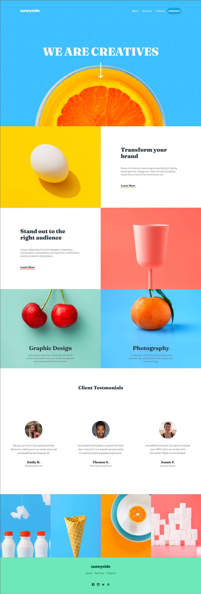
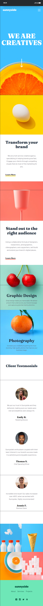

<div align="center">

# Sunnyside Landing Page

  <br />
  <a href="#about"><strong>Explore the screenshots »</strong></a>
  <br />
  <br />
  <a href="https://github.com/raphaeleliass/Sunnyside-React/issues/new?assignees=&labels=bug&template=01_BUG_REPORT.md&title=bug%3A+">Report a Bug</a>
  ·
  <a href="https://github.com/raphaeleliass/Sunnyside-React/issues/new?assignees=&labels=enhancement&template=02_FEATURE_REQUEST.md&title=feat%3A+">Request a Feature</a>
  .
  <a href="https://github.com/raphaeleliass/Sunnyside-React/issues/new?assignees=&labels=question&template=04_SUPPORT_QUESTION.md&title=support%3A+">Ask a Question</a>
</div>

<div align="center">
<br />

[](LICENSE)

[](https://github.com/raphaeleliass/Sunnyside-React/issues?q=is%3Aissue+is%3Aopen+label%3A%22help+wanted%22)
[](https://github.com/raphaeleliass)

</div>

<details open="open">
<summary>Table of Contents</summary>

- [About](#about)
  - [Built With](#built-with)
- [Getting Started](#getting-started)
  - [Prerequisites](#prerequisites)
  - [Installation](#installation)
- [Authors & contributors](#authors--contributors)
- [License](#license)

</details>

---

## About

The Sunnyside project was developed with the aim of enhancing my learning with React.js and putting into practice what I have learned so far. Concepts of props, flexbox, and grid were used.

> You can access the website by clicking [here](https://raphaelelias-sunnyside.vercel.app)

<details>
<summary>Screenshots</summary>

<br>

<div align='center'>

### Desktop

  
  
  ### Mobile
  
</div>

</details>

### Built With

> - React JS
>   <br/>
> - Tailwindcss

## Getting Started

### Prerequisites

> - NodeJS

### Installation

> First, you should install the dependencies that were used in the project:

```bash
npm create vite@latest
npm install -D tailwindcss postcss autoprefixer
npx tailwindcss init -p
npm install react-icons
```

> Lastly, execute the following command:

```bash
npm run dev
```

## Authors & contributors

The original setup of this repository is by [Raphael Elias](https://github.com/raphaeleliass).

For a full list of all authors and contributors, see [the contributors page](https://github.com/raphaeleliass/Sunnyside-React/contributors).

## License

This project is licensed under the **MIT license**.

See [LICENSE](LICENSE) for more information.
